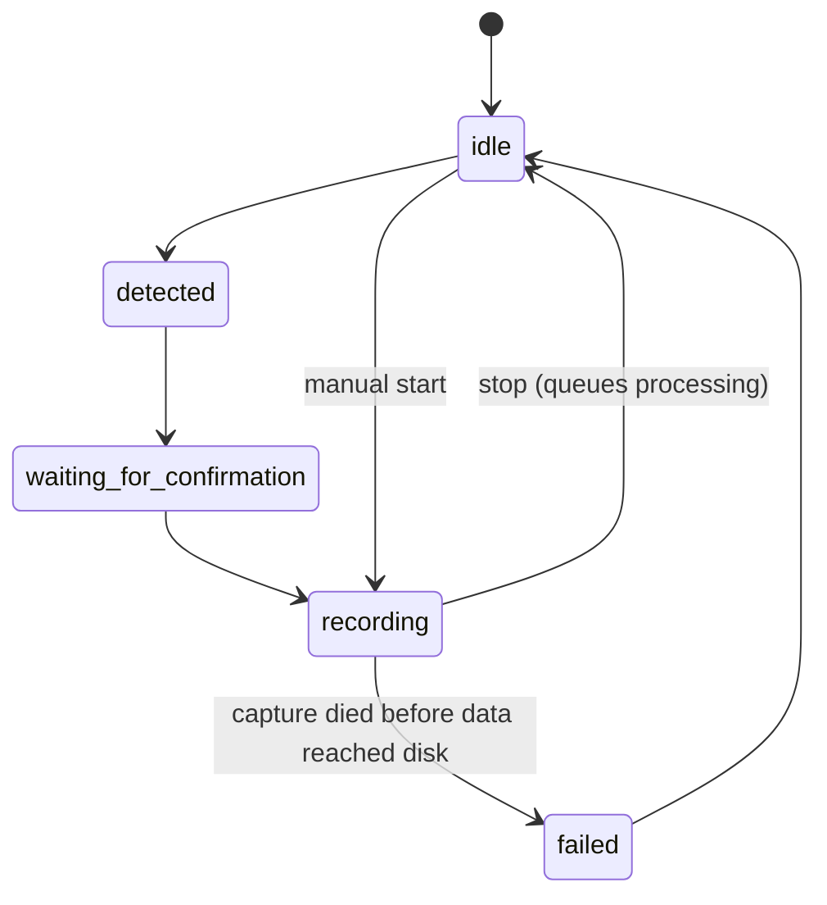
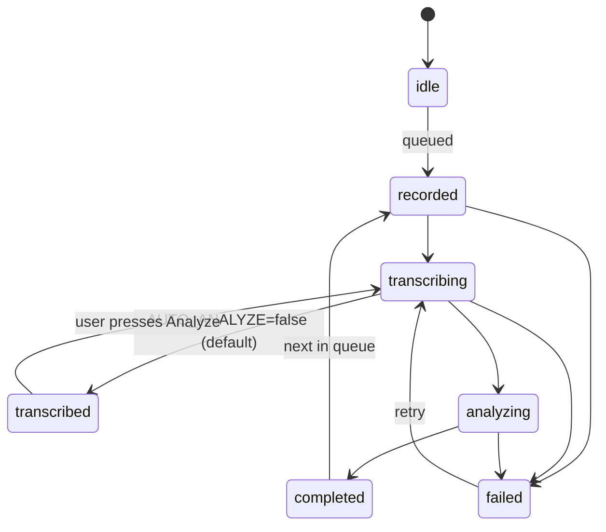

# Meeting AI — Complete Project Documentation

**Project version:** 0.1.0  
**Platform:** macOS on Apple Silicon  
**Document updated:** August 30, 2026

Meeting AI is a local-first meeting recorder, transcription system, and meeting-intelligence application. It records macOS system audio and microphone audio, transcribes both sources locally with faster-whisper, produces a structured report with a local Ollama model, stores the results in SQLite and local files, and displays meetings and tasks in a React interface.

The system is intentionally private:

- recordings remain on the Mac;
- transcription runs locally;
- meeting analysis runs through local Ollama;
- there is no cloud backend, telemetry, analytics, or authentication service;
- recording starts only after the user explicitly presses **Start recording**;
- macOS permissions are never bypassed;
- recordings and transcripts are preserved when processing fails.

## 1. Quick start

### 1.1 Prerequisites

- macOS on Apple Silicon
- Python 3.11 or newer; Python 3.12 is recommended
- Node.js 18 or newer
- ffmpeg
- Ollama
- Google Chrome for Meet-tab detection
- Xcode Command Line Tools for compiling the Swift audio helper
- BlackHole 2ch only if the native ScreenCaptureKit helper cannot be used

Install common Homebrew dependencies:

```bash
brew install python@3.12 node ffmpeg ollama
```

### 1.2 Install the project

```bash
cd /Users/hussainmehdi/Documents/Codex/2026-08-10/files-mentioned-by-the-user-you/outputs/meeting-ai
chmod +x scripts/*.sh
./scripts/setup.sh
```

The setup script:

1. selects a supported Python interpreter;
2. creates `.venv`;
3. installs Python requirements;
4. installs frontend packages;
5. creates `data/meetings` and `logs`;
6. copies `.env.example` to `.env` when needed;
7. builds the native Swift capture helper;
8. runs the environment checker.

### 1.3 Prepare the local AI model

Ollama may already be running as a macOS background service. Check it first:

```bash
curl http://127.0.0.1:11434/api/tags
```

If it is not running:

```bash
ollama serve
```

Install the configured report model:

```bash
ollama pull qwen3:14b
```

The current default configuration uses `qwen3:14b`. Do not run two `ollama serve` processes; an “address already in use” message normally means Ollama is already running.

### 1.4 Run Meeting AI

```bash
./scripts/start.sh
```

Open:

- UI: <http://localhost:3000>
- API: <http://localhost:8000>
- Health check: <http://localhost:8000/api/health>

Stop both development servers with **Control+C** in the terminal running `start.sh`.

## 2. High-level architecture

```mermaid
flowchart LR
    Chrome["Google Meet tab detection"] --> Approval["Explicit user approval"]
    Approval --> Capture["ScreenCaptureKit or BlackHole capture"]
    Capture --> WAV["System and microphone WAV files"]
    WAV --> Whisper["faster-whisper"]
    Whisper --> Transcript["Timestamped transcript"]
    Transcript --> Extract["Ollama evidence extraction"]
    Extract --> Final["Ollama final synthesis"]
    Final --> Validate["Deterministic checks and Pydantic validation"]
    Validate --> Files["Local JSON artifacts"]
    Validate --> SQLite["SQLite database"]
    SQLite --> API["FastAPI"]
    API --> React["React and Vite UI"]
```



Main data flow:

```text
Chrome detection
  → explicit Start recording
  → separate system and microphone recordings
  → local Whisper transcription
  → transcript cleanup and quality check
  → chunked local Ollama analysis
  → deterministic evidence repair
  → Pydantic validation
  → atomic report storage
  → SQLite persistence
  → FastAPI
  → React UI
```

Long-running transcription and Ollama work execute in worker threads with `asyncio.to_thread`, keeping the FastAPI event loop responsive.

## 3. Technology stack

| Area | Technology | Purpose |
|---|---|---|
| Native audio | Swift, ScreenCaptureKit, AVFoundation | Capture system and microphone audio without changing normal Mac output |
| Audio fallback | BlackHole 2ch, AVFoundation, ffmpeg | Capture system audio when the native helper is unavailable |
| Audio processing | ffmpeg | Preview mixing, resampling, filtering, and volume measurement |
| Backend | Python, FastAPI, Uvicorn | API, lifecycle orchestration, recovery, and local services |
| Transcription | faster-whisper, CTranslate2 | Local speech recognition and optional translation |
| Meeting analysis | Ollama with `qwen3:14b` | Local evidence extraction and structured meeting reports |
| Validation | Pydantic | Enforce the final report schema |
| Persistence | SQLite and JSON/text files | Store meetings, transcripts, reports, people, and tasks |
| PDF export | ReportLab | Generate searchable completed-meeting reports locally on demand |
| Frontend | React, TypeScript, Vite | Local meeting and task interface |
| Icons | Lucide React | Interface icons |
| Testing | pytest, FastAPI TestClient, TypeScript compiler, Vite build | Backend and frontend verification |

## 4. Project structure

```text
meeting-ai/
├── AGENTS.md                       Contributor safety rules
├── README.md                       Short setup and usage guide
├── PROJECT_DOCUMENTATION.md        This complete project handoff
├── .env.example                    Configuration template
├── requirements.txt                Python dependencies
├── pytest.ini                      Test configuration
├── backend/
│   ├── main.py                     FastAPI application and lifecycle
│   ├── config.py                   Environment configuration
│   ├── state.py                    Runtime state machine
│   ├── api/routes.py               REST API routes
│   ├── meetings/service.py         Recording and processing orchestration
│   ├── audio/devices.py            AVFoundation/CoreAudio device discovery
│   ├── audio/recorder.py           Native capture and BlackHole fallback
│   ├── transcription/whisper.py    Whisper transcription and cleanup
│   ├── analysis/prompts.py         System, extraction, and final prompts
│   ├── analysis/ollama.py          Ollama client, chunking, repair, validation
│   ├── analysis/schemas.py         Final Pydantic report schema
│   ├── reports/pdf.py               Local PDF report renderer
│   ├── analysis/dates.py           Relative-deadline normalization
│   ├── database/db.py              SQLite schema and queries
│   ├── detection/meet_detector.py  Chrome Meet-tab detection
│   └── notifications/macos.py      Native macOS notifications
├── native/
│   └── MeetingAudioCapture.swift   ScreenCaptureKit recording helper
├── bin/
│   └── meeting-audio-capture       Compiled native helper
├── frontend/
│   ├── src/App.tsx                 Application pages and behavior
│   ├── src/api.ts                  API wrapper
│   ├── src/styles.css              Main styling
│   ├── src/processing.css          Processing display styling
│   ├── src/recovery.css            Retry interface styling
│   ├── package.json                Frontend scripts and packages
│   └── vite.config.ts              Vite configuration
├── scripts/
│   ├── setup.sh                    Full setup
│   ├── start.sh                    Backend and frontend launcher
│   ├── check_environment.sh        Read-only environment checks
│   ├── build_native_audio.sh       Compile Swift helper
│   └── diagnose_audio.sh           BlackHole audio diagnostic
├── tests/test_core.py              Backend unit and integration tests
├── data/meetings.db                SQLite database
├── data/meetings/                  Per-meeting artifacts
└── logs/app.log                    Rotating application log
```

Generated directories such as `.venv`, `frontend/node_modules`, `.build`, `frontend/dist`, and Python caches should not be treated as source code.

## 5. Configuration

Meeting AI reads `.env` through `pydantic-settings`. Unknown environment variables are ignored.

| Variable | Current/default value | Meaning |
|---|---|---|
| `USER_NAME` | `Hussain` | Canonical name assigned to the microphone source and personal tasks |
| `USER_ALIASES` | `Hussain,Husain` | Comma-separated aliases used by the My Tasks query |
| `OLLAMA_HOST` | `http://localhost:11434` | Local Ollama API |
| `OLLAMA_MODEL` | `qwen3:14b` | Local meeting-analysis model |
| `OLLAMA_NUM_CTX` | `32768` | Ollama context window allocated for prompts, evidence, and report output |
| `WHISPER_MODEL` | `large-v3` | faster-whisper model |
| `WHISPER_LANGUAGE` | empty | Automatic source-language detection |
| `WHISPER_TASK` | `transcribe` | Keep the original spoken language as the source of truth. `translate` is the legacy mode that translates while transcribing and loses the original wording |
| `WHISPER_TRANSLATION` | `auto` | Separate English pass: `auto` only when the meeting is not in English, `always`, or `never`. Stored as `text_en`; the analyst reads it, the original `text` is never modified |
| `WHISPER_BACKEND` | `auto` | `mlx` runs the same weights on the Apple GPU (Metal); `faster` is the CPU path. `auto` picks MLX on Apple Silicon |
| `WHISPER_OFFLINE` | `true` | Once weights are cached, never contact the network for them |
| `DIARIZATION_ENABLED` | `true` | Separate remote participants by voice on the system track (CAM++ embeddings via sherpa-onnx, local) |
| `DIARIZATION_THRESHOLD` | `0.62` | Cosine distance at which two voices are considered different people (0.60–0.65 is the stable band on real meetings) |
| `VOICE_MATCH_THRESHOLD` | `0.70` | Cosine similarity required to reuse a remembered name automatically |
| `DETECTION_BROWSERS` | `Google Chrome` | Chromium-family browsers whose tabs are scanned for Meet, Zoom web, and Teams web |
| `DETECT_ZOOM_APP` | `true` | Detect a Zoom desktop meeting (the `CptHost` helper only runs during a call) |
| `DETECT_TEAMS_APP` | `true` | Detect a Teams desktop meeting window (needs Accessibility access; silently skipped otherwise) |
| `WHISPER_TASK` | `translate` | Translate recognized speech to English; use `transcribe` to preserve language |
| `WHISPER_INITIAL_PROMPT` | technical meeting vocabulary | Helps preserve names and technical terminology |
| `DATABASE_PATH` | `data/meetings.db` | SQLite location |
| `RECORDINGS_PATH` | `data/meetings` | Root for meeting folders |
| `DETECTION_INTERVAL` | `3.0` | Seconds between Chrome detection checks |
| `DETECTION_TIMEOUT` | `15.0` | Seconds to wait for Chrome to answer one detection check; a timeout is logged and ignored |
| `DETECTION_END_CONFIRMATIONS` | `5` | Consecutive "no Meet tab" readings required before an active recording is auto-stopped |
| `MAX_RECORDING_HOURS` | `4.0` | A recording longer than this is stopped and saved automatically by the watchdog |
| `AUTO_ANALYZE` | `false` | After a recording only the transcript is produced and the meeting waits in `transcribed` for review; the user presses **Analyze**. `true` restores the single-step flow |
| `RESUME_INTERRUPTED_PROCESSING` | `true` | On startup, continue processing meetings whose transcription or analysis was cut off by a restart |
| `DEFER_PROCESSING_WHILE_RECORDING` | `true` | Never start Whisper/Ollama while a recording is being captured; queued meetings wait until the recording stops |

Recommended `.env`:

```dotenv
USER_NAME=Hussain
USER_ALIASES=Hussain,Husain
OLLAMA_HOST=http://localhost:11434
OLLAMA_MODEL=qwen3:14b
WHISPER_MODEL=large-v3
WHISPER_LANGUAGE=
WHISPER_TASK=translate
WHISPER_INITIAL_PROMPT=Software engineering meeting. Hussain. Preserve names, product names, APIs, GitHub, Figma, frontend, backend, deployment, deadlines, and technical terms.
DATABASE_PATH=data/meetings.db
RECORDINGS_PATH=data/meetings
```

Do not place passwords or unrelated secrets in `.env`. The application does not require cloud credentials. An optional Hugging Face token can increase first-download rate limits, but it is not needed after the Whisper model is cached.

## 6. macOS permissions

The native capture path requires permission for the terminal or host application that launches Meeting AI:

- **Privacy & Security → Screen & System Audio Recording**
- **Privacy & Security → Microphone**

Chrome detection may additionally require:

- **Privacy & Security → Automation → Google Chrome**

After changing a permission, fully stop and restart Terminal, Codex, VS Code, or whichever application launches Meeting AI. The application does not attempt to bypass denied permissions.

## 7. Meeting detection and explicit approval

`MeetDetector` polls a list of providers every configured interval: a browser-tab provider per configured Chromium browser (Google Meet, Zoom web, Teams web URLs), a Zoom desktop provider (the `CptHost` process exists only during a call), and a Teams desktop provider (meeting window title via System Events). The first provider that reports a meeting wins; a provider that errors is ignored for that tick. The detected platform is stored on the meeting.

Detection only means a Meet page is open. It does not prove that a call is active. Therefore:

- detection creates a notification and moves the state to `waiting_for_confirmation`;
- recording never starts automatically from detection;
- the user must press **Start recording**;
- closing or navigating away from the detected Meet tab stops an active recording, but only after `DETECTION_END_CONFIRMATIONS` consecutive checks (about 15 seconds by default) agree that the tab is gone;
- a detection check that fails (Chrome busy, AppleScript error, timeout) is logged and never treated as the meeting ending;
- a watchdog stops and saves the recording if the audio capture process dies or the `MAX_RECORDING_HOURS` limit is reached;
- the manual **Stop recording** button remains the dependable fallback.

### Meeting templates

A template is chosen next to **Start recording** and stored on the meeting. Templates (`backend/analysis/templates.py`) only append guidance to the analyst's system prompt — engineering (default), stand-up, one-on-one, client call, interview, general — so they change emphasis, never the evidence rules.

## 8. Audio capture

### 8.1 Primary path: ScreenCaptureKit

`native/MeetingAudioCapture.swift` is compiled into `bin/meeting-audio-capture`. The helper uses `SCStream` to write two independent WAV files:

- `recording-system.wav`: system/remote meeting audio;
- `recording-microphone.wav`: local microphone audio.

Keeping sources separate avoids mixing independent device clocks during live capture, which previously caused slow, distorted, or pitch-shifted speech. Normal MacBook output remains selected, so macOS volume keys continue working.

### 8.2 Fallback path: BlackHole

If the compiled helper is unavailable, `AudioRecorder` discovers BlackHole dynamically through AVFoundation and records with ffmpeg. The fallback does not assume a fixed device index.

For fallback capture, create a Multi-Output Device in Audio MIDI Setup containing:

- MacBook Pro Speakers;
- BlackHole 2ch.

Select that Multi-Output Device as macOS output during the meeting. A disabled volume overlay is a normal macOS limitation of aggregate/multi-output devices, which is one reason native ScreenCaptureKit is preferred.

### 8.3 Preview and archival audio

After recording stops, ffmpeg creates `recording.wav`, a convenient 16 kHz mono preview. System audio is kept near full volume; the microphone path is filtered and attenuated before mixing.

The source tracks—not the preview—are the archival recordings. If preview generation fails, the original system and microphone WAV files remain usable and processing continues from them.

### 8.4 Audio quality gate

### Transcription engine

On Apple Silicon the `large-v3` weights run through `mlx-whisper` on the GPU; measured on a real 41-minute meeting: system track 87 s, microphone track 18 s, full pipeline with diarization 111 s (the CPU path took ~55 minutes). The CPU path (`faster-whisper`) remains as fallback and uses beam search; MLX decodes greedily with the same temperature fallback, VAD, and thresholds. Word-level agreement between the two on that meeting was 94.6%, the differences being fillers at chunk edges.

The transcript keeps the **original spoken language** in `text`. When the meeting is not in English a second Whisper pass produces `text_en`, aligned to the original segments by time; the LLM analyst reads `text_en` so evidence checks still work, while the UI shows both. Each line stores Whisper's `avg_logprob` and `no_speech_prob`; low-confidence lines are flagged in the UI and lower the quality score.

### Speakers

The system track is diarized locally: every line gets a CAM++ voice embedding, embeddings are clustered (average linkage, cosine distance), voices are ordered by speaking time and labelled `Speaker 1…N`. The user can name a voice once from the transcript; with **Remember voice** the centroid is stored in `voice_profiles`, and later meetings label that person automatically (`recognised NN%`). Unnamed voices are passed to the analyst as distinct but anonymous people; confirmed names are treated as real attendees who can own tasks.

### Two-phase flow: transcribe, review, analyze

By default a stopped recording is only transcribed. The meeting then rests in status `transcribed` (the processing worker is free for the next meeting), a notification says the transcript is ready, and the detail page opens the transcript under a **Transcript ready — review it before analysis** banner. The user can correct lines, delete lines, rename or name speakers, and only when they press **Analyze this transcript** does the LLM run — on the transcript exactly as reviewed, never on the raw one. Nothing reaches the analyst before that click. Set `AUTO_ANALYZE=true` to skip the review step.

### Evidence playback and corrections

Every task and requested change is mapped back to the transcript line its evidence came from (`evidence_location`), and the detail page plays that span from the saved recording. Above the transcript a player plays the whole meeting: scrubber, ±15 s, 0.75x–2x speed, and a *Follow transcript* option that highlights the line being spoken and keeps it in view. Clicking a line's timestamp plays just that line; shift-clicking it plays on from there. All of it streams the saved WAV from `/meetings/{id}/audio` with range requests. Transcript lines can be corrected in place (double-click), speakers renamed, and the analysis re-run from the corrected transcript without re-running Whisper.

Before transcription, ffmpeg `volumedetect` measures the selected saved track. A peak above `-60 dB` is treated as audible. Definite silence stops processing so Whisper and the LLM cannot fabricate a meeting from empty audio.

### 8.5 Audio diagnostic

Native capture normally does not need BlackHole. To test the active recorder:

```bash
.venv/bin/python -m backend.audio.recorder --test --seconds 10
```

A healthy result contains:

```text
'has_audible_audio': True
```

For the BlackHole fallback diagnostic:

```bash
./scripts/diagnose_audio.sh
```

Use headphones during real meetings when possible. Laptop speakers can leak remote speech into the microphone, creating acoustic duplicates even though system audio is already captured directly.

## 9. Transcription pipeline

`TranscriptionService` loads `faster_whisper.WhisperModel` lazily with:

- device: CPU;
- compute type: `int8`;
- model: `large-v3` by default;
- VAD enabled;
- beam size and best-of: 5;
- previous-text conditioning disabled;
- multiple fallback temperatures;
- hallucination and compression filters.

The service transcribes each source independently:

| Source file | Transcript label |
|---|---|
| `recording-system.wav` | `Other participant` |
| `recording-microphone.wav` | configured `USER_NAME` |
| `recording.wav` fallback | `Speaker` |

`Other participant` is a source label, not an inferred identity or attendee.

After transcription, segments are merged by timestamp. Cleanup then:

- removes adjacent exact repetitions;
- caps repeated hallucinated phrases;
- compares nearby cross-source segments;
- removes a near-identical microphone copy when system audio already captured it;
- retains unique microphone speech;
- calculates a transcript quality score.

The resulting files are:

- `transcript.json`: metadata, quality information, and timestamped segments;
- `transcript.txt`: readable `speaker: text` lines.

If quality is below 45%, the transcript and recording remain saved but AI summarization is blocked to avoid a misleading report.

### 9.1 First Whisper download

The first use of `large-v3` downloads the model from Hugging Face. The warning below is informational:

```text
You are sending unauthenticated requests to the HF Hub
```

The model remains local after download. If an authenticated download is desired, create a read token on Hugging Face and export `HF_TOKEN` before the first run.

## 10. AI meeting analysis

Meeting analysis uses local Ollama with deterministic generation settings:

- streaming disabled;
- `think: false`;
- temperature `0`;
- structured JSON schemas supplied to Ollama;
- a 32,768-token context allocation by default;
- long request timeouts suitable for a 14B local model.

### 10.1 Stage 1: evidence extraction and action audit

Long transcripts are split primarily at line boundaries into chunks of approximately 12,000 characters with a small line overlap. Each chunk is analyzed into candidate evidence such as:

- summary points;
- goals;
- key topics;
- decisions;
- named people;
- tasks, owners, evidence, priority, confidence, and deadlines;
- explicit requested product, design, code, content, and process changes;
- next steps;
- useful named entities.

Every task and requested-change candidate receives a deterministic source chunk ID. Each chunk receives a general evidence pass and a separate action audit focused on Hussain's assignments, first-person commitments, other-participant commitments, modification requests, and attached deadlines. The model is instructed to keep empty arrays instead of inventing content.

### 10.2 Stage 2: final synthesis

The final prompt receives:

- authoritative meeting metadata;
- the exact Pydantic JSON schema;
- extracted evidence candidates;
- the full source transcript for meetings up to 16,000 characters;
- the meeting date for relative-deadline normalization.

The prompt asks the model to consolidate duplicates, separate proposals from decisions, require evidence for tasks, avoid inferred attendees, and write a comprehensive professional summary covering Hussain, other participants, requested changes, outcomes, and follow-up.

### 10.3 Deterministic safety layer

Model output is repaired and checked before Pydantic validation. The code:

- overwrites model-provided meeting metadata with authoritative values;
- forces attendees to an empty list because reliable browser participant metadata is unavailable;
- normalizes malformed summaries and list/object variants;
- converts numeric confidence to `low`, `medium`, or `high`;
- normalizes priorities and person importance;
- verifies task evidence against the transcript;
- canonicalizes configured user aliases to `Hussain`;
- validates owners against cited evidence and narrow nearby context;
- recovers minor model evidence wording differences while retaining actual transcript wording;
- validates requested changes independently from confirmed tasks;
- rejects unsupported task owners and requested-change recipients;
- verifies deadline phrases against the transcript;
- converts supported deadline variants to the final schema;
- rejects artificial speaker labels as people;
- requires mentioned names to appear in the transcript;
- deduplicates tasks and people.

Numeric confidence conversion is:

| Numeric value | Final value |
|---|---|
| 0.00–0.49 | `low` |
| 0.50–0.79 | `medium` |
| 0.80–1.00 | `high` |

The final JSON is validated against `MeetingAnalysis`. If validation fails, Ollama receives the validation error once and is asked to return a complete corrected object. A second failure becomes a recoverable processing error.

### 10.4 Final report schema

The saved report contains:

- meeting metadata;
- a summary string;
- goals;
- key topics;
- confirmed decisions;
- attendees, currently forced empty;
- people mentioned with context and importance;
- tasks with owner, action, deadline, priority, confidence, and evidence;
- requested changes with recipient, requested modification, deadline, priority, confidence, and evidence;
- next steps.

The final report and UI intentionally do not include an **Open Questions** section.

## 11. Processing progress

The UI displays four milestone percentages:

| Milestone | Percentage |
|---|---:|
| Recording saved | 5% |
| Whisper transcription | 55% |
| AI meeting analysis | 92% |
| Results saved | 100% |

Backend progress details provide finer-grained updates between those milestones, including model loading, local transcription, chunk analysis, final synthesis, validation, and storage.

Actual processing time depends on Mac performance, transcript length, whether Whisper is already loaded, and Ollama model size. A one-minute meeting can still take longer than one minute on CPU when `large-v3` and a 14B model are both used.

## 12. Runtime state machine

Recording and processing are two independent machines inside one `StateMachine`, so a new meeting can be recorded while the previous one is still being transcribed or analyzed.

Recording lifecycle (`status.state`):



Processing pipeline (`status.processing.state`):



Processing runs on a single background worker so Whisper and Ollama never run twice at once, and the worker does not start a meeting while a recording is active: the capture is the source of truth for the transcript, so it always gets the machine to itself (the Whisper model is never downgraded to make room). Meetings that finish while another is processing wait in `status.processing.queued` and are shown as *Queued for processing*. Retrying a meeting joins the same queue. The machine is protected by an `RLock`.

## 13. Failure recovery

Recovery is checkpoint-based:

```text
Saved transcript available → retry Ollama directly
No transcript, recording available → rerun Whisper, then Ollama
Neither available → preserve metadata and report that recovery cannot proceed
```

On processing failure:

- the database meeting becomes `failed`;
- a user-readable error is stored;
- `recovery.json` records available artifacts and the recommended retry stage;
- existing recordings and transcripts are not deleted;
- old successful report data is not cleared merely because a new attempt failed;
- validated analysis attempts are archived;
- the UI exposes recovery buttons.

On application restart, database rows left in `recording`, `recorded`, `transcribing`, or `analyzing` are converted to explicit retryable failures instead of remaining stuck forever.

### 13.1 Retry from the UI

Open a failed or completed meeting and choose:

- **Analyze saved transcript again**: skips Whisper and sends the saved transcript back to Ollama;
- **Re-transcribe recording**: runs Whisper again from the original WAV tracks, then reruns analysis.

The first option is faster and is appropriate for an Ollama exception or a poor report based on an acceptable transcript. The second option is appropriate when the transcript itself is wrong.

### 13.2 Retry through the API

Analyze the saved transcript when available:

```bash
curl -X POST http://127.0.0.1:8000/api/meetings/MEETING_ID/retry \
  -H 'Content-Type: application/json' \
  -d '{"retranscribe": false}'
```

Force re-transcription from audio:

```bash
curl -X POST http://127.0.0.1:8000/api/meetings/MEETING_ID/retry \
  -H 'Content-Type: application/json' \
  -d '{"retranscribe": true}'
```

Only one recording or processing job may run at a time.

## 14. Local storage

Each meeting has an ID such as:

```text
20260818-122244-c8064e
```

Its folder can contain:

```text
data/meetings/<meeting-id>/
├── recording-system.wav
├── recording-microphone.wav
├── recording.wav
├── transcript.json
├── transcript.txt
├── analysis.json
├── recovery.json
└── analysis-attempts/
    ├── analysis-<timestamp>.json
    └── analysis-<timestamp>-previous.json
```

Meanings:

| Artifact | Purpose |
|---|---|
| `recording-system.wav` | Original system audio |
| `recording-microphone.wav` | Original microphone audio |
| `recording.wav` | Listening preview; not the only recovery source |
| `transcript.json` | Structured transcript, metadata, and quality |
| `transcript.txt` | Readable transcript |
| `analysis.json` | Current validated meeting report |
| `analysis-attempts/` | Validated current/previous report versions |
| `recovery.json` | Last failure checkpoint and artifact availability |

`logs/app.log` rotates at approximately 2 MB with three backups. Logs intentionally omit raw audio and complete transcripts.

## 15. SQLite data model

Database: `data/meetings.db`

| Table | Main purpose |
|---|---|
| `meetings` | Meeting metadata, status, paths, summary, and errors |
| `transcript_segments` | Ordered timestamps, speaker source, and segment text |
| `people` | Mentioned people and any authoritative attendees |
| `tasks` | Owner, task, deadline, priority, confidence, evidence, and completion status |
| `requested_changes` | Explicit modification requests, recipients, deadlines, priority, confidence, and evidence |
| `decisions` | Confirmed decision strings |
| `goals` | Goal strings |
| `key_topics` | Topic strings |
| `next_steps` | Ordered follow-up strings |

Task status is either `open` or `completed`. My Tasks queries all configured aliases and deduplicates by task ID.

Useful read-only database checks:

```bash
sqlite3 data/meetings.db '.tables'
sqlite3 data/meetings.db 'SELECT id, title, status, started_at FROM meetings ORDER BY started_at DESC LIMIT 10;'
```

Avoid manually changing the database while the backend is running.

## 16. REST API

Base URL: `http://127.0.0.1:8000/api`

| Method | Route | Purpose |
|---|---|---|
| `GET` | `/health` | Local service health |
| `GET` | `/status` | Runtime state, stage, progress, and errors |
| `GET` | `/meetings` | List meetings; optional `q` search query |
| `GET` | `/meetings/{id}` | Meeting report, tasks, artifact availability, and status |
| `GET` | `/meetings/{id}/report.pdf` | Download the latest completed report as a local PDF |
| `GET` | `/meetings/{id}/transcript` | Timestamped transcript segments |
| `GET` | `/meetings/{id}/analysis` | Current `analysis.json` |
| `PATCH` | `/meetings/{id}/info` | Edit title and mentioned people after analysis completes |
| `GET` | `/meetings/{id}/transcript` | `{segments, speakers}`; segments carry `text`, `text_en`, confidence, `speaker_id`, `edited` |
| `PATCH` | `/meetings/{id}/transcript/{segment_id}` | Correct one line's text or speaker; transcript files are regenerated |
| `DELETE` | `/meetings/{id}/transcript/{segment_id}` | Remove a line from the transcript (e.g. noise, cross-talk, something private) |
| `POST` | `/meetings/{id}/analyze` | Run the AI analysis on the transcript as reviewed; the explicit go-ahead in the two-phase flow |
| `POST` | `/meetings/{id}/speakers` | Name a diarized voice (`speaker_id` or `current_label`); `remember` stores the voice for future meetings |
| `GET` | `/meetings/{id}/audio?track=mix\|system\|microphone` | Stream the saved recording (range requests) for evidence playback |
| `GET` | `/meetings/{id}/transcript/export?format=txt\|srt\|json&language=both\|original\|english` | Whole transcript as a download (`download=false` returns it inline for copying) |
| `GET` / `DELETE` | `/voices`, `/voices/{name}` | List or forget remembered voices |
| `GET` | `/templates` | Meeting templates for the Start picker |
| `DELETE` | `/meetings/{id}` | Permanently delete a meeting, its folder under `RECORDINGS_PATH`, and every derived row (refused while recording, processing, or queued) |
| `GET` | `/tasks` | All tasks |
| `GET` | `/tasks/me` | Tasks owned by configured user aliases |
| `PATCH` | `/tasks/{id}` | Change status to `open` or `completed` |
| `POST` | `/recording/start` | Start after explicit user action |
| `POST` | `/recording/stop` | Stop, save, and schedule processing |
| `POST` | `/meetings/{id}/retry` | Retry from transcript or recording |
| `GET` | `/audio/devices` | Audio discovery report |
| `GET` | `/settings` | Non-secret local configuration and service availability |

Start request:

```json
{
  "title": "Weekly engineering sync",
  "meet_url": "https://meet.google.com/example"
}
```

Task update request:

```json
{
  "status": "completed"
}
```

Completed meeting info update request:

```json
{
  "title": "Weekly engineering sync",
  "people_mentioned": [
    {
      "name": "Ahmad Khan",
      "context": "Will review the release plan.",
      "importance": "high"
    }
  ]
}
```

The server rejects this request until the meeting status is `completed`. It updates only the meeting title and `mentioned` people records. Date/time, transcript, summary, goals, topics, decisions, tasks, and next steps are not changed. These manual corrections are stored separately and reapplied after a later analysis retry.

## 17. Frontend behavior

The React application polls status, meetings, and personal tasks every 2.5 seconds.

Pages:

- **Home**: current recording/processing status, progress, open tasks, and recent meetings;
- **Meetings**: local meeting library;
- **My Tasks**: open and completed personal tasks;
- **Search**: searches titles, summaries, transcripts, tasks, and people through the backend;
- **Settings**: current profile, AI models, Ollama status, audio status, storage, and privacy;
- **Meeting detail**: comprehensive summary, Hussain's action plan, requested changes, other-participant actions, goals, topics, decisions, people, next steps, PDF download, transcript, recovery controls, and completed-meeting info editing.

The PDF download is available only after analysis completes. It is rendered from the current SQLite record rather than the older `analysis.json`, so a corrected meeting title, corrected people, and current task completion statuses are included. Open and completed tasks are separated, internal owner sentinels receive readable labels, and Urdu or Arabic text receives right-to-left shaping. Generation happens in memory, no stale export is retained, and HTTP responses use `no-store` caching for meeting privacy.

The full transcript is loaded only when the disclosure is opened. Failed and completed meetings show retry controls when a recording or transcript exists. The edit button appears only for completed meetings; date, start time, end time, and duration are read-only in the form.

## 18. Scripts

### `./scripts/setup.sh`

Creates the Python environment, installs packages, builds the native helper, and performs environment checks.

### `./scripts/start.sh`

Starts Uvicorn on port 8000 and Vite on port 3000, and stops both on Control+C.

### `./scripts/check_environment.sh`

Read-only checks for macOS, Apple Silicon, Python, ffmpeg, Chrome, Ollama, the configured model, native helper, optional BlackHole, and Node.js.

### `./scripts/build_native_audio.sh`

Compiles the Swift ScreenCaptureKit helper:

```bash
./scripts/build_native_audio.sh
```

### `./scripts/diagnose_audio.sh`

Lists audio devices, records a test, plays a tone through the current output, measures the recording, and reports pass/fail for the BlackHole fallback.

## 19. Development and verification

Backend syntax check:

```bash
.venv/bin/python -m compileall -q backend
```

Backend tests:

```bash
PYTHONPATH=. .venv/bin/python -m pytest -q
```

Frontend production build:

```bash
npm --prefix frontend run build
```

At the time this document was created, the test suite contained 12 passing tests. Tests cover:

- deadline normalization;
- state transitions;
- database persistence;
- interrupted-processing recovery;
- transcript restoration without Whisper;
- retry from transcript when audio is missing;
- preservation of source audio after preview failure;
- report schema and transcript chunking;
- prompt placeholder formatting;
- deterministic Ollama output repair;
- API health.

Hardware, permissions, real audio, Whisper model quality, and Ollama performance still require manual acceptance testing on macOS.

## 20. Troubleshooting

### Ollama reports “address already in use”

Ollama is already running. Verify it instead of starting a second server:

```bash
curl http://127.0.0.1:11434/api/tags
```

### Configured Ollama model is missing

```bash
ollama list
ollama pull qwen3:14b
```

Confirm `.env` contains:

```dotenv
OLLAMA_MODEL=qwen3:14b
```

### Ollama download ends with `unexpected EOF`

Retry the same pull. Ollama generally reuses already downloaded layers:

```bash
ollama pull qwen3:14b
```

### Hugging Face unauthenticated warning

This is a rate-limit warning, not a transcription failure. Wait for the model download, or export a read-only `HF_TOKEN` before retrying.

### Recording contains silence

1. Check macOS Screen & System Audio Recording permission.
2. Check microphone permission.
3. Restart the terminal or host application after granting permission.
4. Rebuild the native helper if necessary.
5. Run the recorder test while playing audio and speaking.
6. If using BlackHole fallback, select the Multi-Output Device.

### Audio is distorted or slow

- Prefer native ScreenCaptureKit capture.
- Do not live-mix independent CoreAudio clocks.
- Keep system and microphone tracks separate.
- Use headphones to prevent speaker leakage.
- Rebuild the helper and restart the application.

### Volume keys are disabled

This normally occurs when macOS output is set to a Multi-Output Device. Return output to MacBook Pro Speakers and use the native ScreenCaptureKit helper. The BlackHole fallback requires the Multi-Output Device.

### Transcript is poor

- Confirm both source recordings are clear.
- Keep `WHISPER_MODEL=large-v3` for maximum local accuracy.
- Leave `WHISPER_LANGUAGE` empty for mixed-language automatic detection.
- Use `WHISPER_TASK=translate` for a consistent English report.
- Improve `WHISPER_INITIAL_PROMPT` with real names and recurring technical vocabulary.
- Open the meeting and select **Re-transcribe recording** after configuration changes.

### AI report is poor but transcript is correct

Open the meeting and select **Analyze saved transcript again**. This skips Whisper and uses the existing transcript.

### Processing exception

Open the failed meeting and inspect the recovery panel. The UI indicates whether it can resume from transcript or recording. The application stores the error in SQLite and `recovery.json` without deleting source artifacts.

### Backend code changed but behavior did not

`scripts/start.sh` does not enable Uvicorn auto-reload. Stop it with Control+C and run it again:

```bash
./scripts/start.sh
```

### “No running event loop”

Always schedule processing from the active FastAPI event loop. The current implementation uses async routes plus `asyncio.create_task` and sends blocking work to threads. Do not create background tasks from a synchronous context without a running loop.

## 21. Privacy and safety rules for contributors

Every future change must preserve these constraints:

1. Keep meeting data and AI processing local.
2. Do not add cloud AI, telemetry, or analytics.
3. Never record without explicit approval.
4. Never bypass macOS permissions.
5. Preserve recordings after every failure.
6. Never log secrets, raw audio, or complete transcripts.
7. Never invent meeting facts, owners, deadlines, attendees, or decisions.
8. A mentioned person is not automatically an attendee.
9. Prefer a tested end-to-end path over unnecessary architecture.
10. Run relevant tests before declaring a change complete.

## 22. Current limitations

- Meet detection identifies an open Meet tab, not a guaranteed active call.
- Automatic stop depends on the detected Meet tab disappearing.
- Reliable participant metadata is unavailable, so attendees remain empty.
- Speaker diarization is not implemented; source labels are used instead.
- CPU transcription with `large-v3` and local inference with a 14B model can be slow.
- The UI greeting remains hard-coded; meeting-report ownership is supplied by configured backend aliases, with a small frontend fallback for older responses.
- `MAX_RECORDING_HOURS` exists in configuration but is not currently enforced.
- Model download requires internet on first use; normal meeting processing is local afterward.

## 23. Recommended operational workflow

Before the first real meeting:

```bash
./scripts/check_environment.sh
.venv/bin/python -m backend.audio.recorder --test --seconds 10
curl http://127.0.0.1:11434/api/tags
```

For every meeting:

1. Start Meeting AI.
2. Join the meeting normally.
3. Press **Start recording**.
4. Verify the UI shows Recording.
5. Press **Stop recording** when finished.
6. Watch transcription and analysis progress.
7. Review the transcript before trusting tasks or decisions.
8. Use transcript retry for report failures.
9. Use recording retry only when the transcript itself needs regeneration.

For maintenance:

- back up `data/meetings` and `data/meetings.db` together;
- do not delete a meeting folder merely because its latest analysis failed;
- keep the original WAV files when storage allows;
- update `.env.example` whenever configuration fields change;
- keep prompt schemas, sanitization, Pydantic models, database persistence, and UI fields aligned;
- rerun backend tests and the frontend build after every behavior change.

## 24. Important source files

- `backend/meetings/service.py`: central lifecycle and recovery orchestration
- `backend/audio/recorder.py`: audio capture and preview resilience
- `backend/transcription/whisper.py`: local transcription and cleanup
- `backend/analysis/prompts.py`: meeting-analysis instructions
- `backend/analysis/ollama.py`: chunking, Ollama calls, repair, and validation
- `backend/analysis/schemas.py`: final report contract
- `backend/database/db.py`: persistence and restart recovery
- `backend/api/routes.py`: public local API
- `frontend/src/App.tsx`: UI behavior and retry actions
- `native/MeetingAudioCapture.swift`: native macOS audio capture
- `tests/test_core.py`: regression coverage

This document describes the current local-first implementation. If code and documentation differ, update this file in the same change that modifies behavior.
