# Meeting AI

> A private, local-first macOS meeting recorder that captures system and microphone audio, creates timestamped transcripts with Whisper, and turns meetings into structured reports and actionable tasks with a local Ollama model.

[Complete technical documentation](PROJECT_DOCUMENTATION.md) · [Repository](https://github.com/Hussain-Mehdi/meeting-ai)

## Why Meeting AI?

Meeting AI is designed for people who want useful meeting memory without sending sensitive conversations to a cloud transcription or AI provider.

It records system audio and your microphone into separate local files, transcribes them on your Mac, extracts evidence-backed meeting intelligence, and provides a clean interface for reviewing meetings and tracking tasks.

All processing remains local:

- no cloud AI or transcription;
- no telemetry or analytics;
- no remote application backend;
- no recording without explicit user approval;
- no deletion of source recordings when processing fails.

## Key features

### Native macOS audio capture

- Captures system and microphone audio with Apple's ScreenCaptureKit.
- Keeps normal MacBook output selected, so volume keys continue working.
- Saves system and microphone tracks separately to prevent clock-mixing distortion.
- Creates a mono listening preview after recording.
- Preserves original tracks if preview generation fails.
- Falls back to BlackHole 2ch and ffmpeg when the native helper is unavailable.
- Discovers BlackHole dynamically instead of relying on a fixed device index.
- Measures the saved signal and stops processing when the recording is definite silence.

### Local transcription

- Uses `faster-whisper` locally on the Mac.
- Defaults to the high-accuracy `large-v3` model.
- Supports English, Urdu, Hindi, and mixed-language meetings.
- Can translate mixed speech into a consistent English transcript.
- Preserves timestamps and audio-source labels.
- Uses voice activity detection and hallucination filters.
- Removes repeated Whisper loops and nearby acoustic duplicates.
- Removes cross-track microphone echo even when Whisper chooses different sentence boundaries or slightly shifted timestamps.
- Produces readable text and structured JSON transcripts.
- Calculates transcript quality before AI analysis.

### Evidence-first meeting intelligence

- Uses local Ollama; the default model is `qwen3:14b`.
- Splits long transcripts at natural line boundaries.
- Extracts evidence candidates before writing the final report.
- Generates a comprehensive executive summary covering Hussain, other participants, outcomes, and follow-up.
- Identifies goals and major topics.
- Keeps only confirmed decisions.
- Finds people explicitly mentioned in the conversation.
- Extracts tasks only when ownership or commitment is supported.
- Runs a dedicated second action audit for every transcript chunk so assignments are not lost among general topics.
- Captures explicit requested product, design, code, content, and process changes even when acceptance is not recorded.
- Canonicalizes configured aliases such as `Husain` to `Hussain` for reliable personal-task filtering.
- Preserves exact task evidence from the transcript.
- Extracts and normalizes explicit deadlines.
- Produces practical next steps.
- Never infers attendees from spoken names or source labels.
- Uses deterministic generation settings and structured JSON schemas.
- Validates final output with Pydantic.
- Repairs common local-model shape errors before validation.
- Intentionally excludes an **Open Questions** section from the final report and UI.

### Safe failure recovery

- Keeps recordings when Whisper or Ollama fails.
- Keeps transcripts when report generation fails.
- Retries Ollama directly from a saved transcript without rerunning Whisper.
- Can rerun Whisper from original WAV tracks when the transcript is poor.
- Allows completed meetings to be analyzed again.
- Writes `recovery.json` with the last safe checkpoint.
- Archives validated reports in `analysis-attempts/`.
- Marks interrupted jobs as retryable after restart.
- Prevents a new recording while another meeting is processing.

### Meeting and task interface

- Dashboard with current status and percentage progress.
- Local meeting library and detailed meeting reports.
- Completed-meeting editor for setting a custom title and correcting mentioned people.
- Keeps the original meeting date, time, and duration read-only.
- Keeps manual title and people corrections when AI analysis is retried.
- Never changes the summary, transcript, goals, topics, decisions, tasks, or next steps during an info edit.
- My Tasks page with open and completed tasks.
- Prominent **Hussain — What You Need to Do** action plan with evidence.
- Separate requested-changes and other-participant action sections with owners, deadlines, and priority.
- Task completion controls.
- Search across titles, summaries, transcripts, tasks, and people.
- Settings showing models, storage, audio status, and privacy.
- Native notifications for detection, recording, completion, and failure.
- Explicit **Analyze saved transcript again** and **Re-transcribe recording** actions.
- One-click **Download PDF** for completed meeting reports.
- Generates each searchable PDF locally from the latest saved title, people, actions, and task statuses.
- Preserves Unicode names and applies right-to-left shaping for Urdu and Arabic text in exports.

### Google Meet assistance

- Detects open `meet.google.com` tabs in Google Chrome.
- Shows a native notification when a Meet tab is found.
- Requires manual approval for every recording.
- Stops an active recording when the detected tab disappears.
- Always provides a manual Stop button.

## Screens and report sections

The application includes:

- **Home** — status, progress, tasks, and recent meetings;
- **Meetings** — complete local meeting library;
- **My Tasks** — tasks assigned to configured user aliases;
- **Search** — meeting, transcript, person, decision, and task search;
- **Settings** — AI, audio, storage, and privacy information;
- **Meeting detail** — comprehensive summary, Hussain's action plan and requested changes, other-participant actions and requested changes, goals, topics, decisions, mentioned people, next steps, PDF download, recovery controls, and full transcript.

The final report contains:

```text
Meeting metadata
Summary
Goals
Key topics
Decisions
Attendees (empty until authoritative metadata is available)
People mentioned
Tasks
Requested changes
Next steps
```

Completed reports can be downloaded as polished, searchable PDFs. The export is created on demand from the current database record, so manual meeting-info corrections and task completion changes appear immediately without modifying the original AI analysis or saving stale PDF copies.

## Architecture

```mermaid
flowchart LR
    Meet["Google Meet tab"] --> Approval["Explicit Start recording"]
    Approval --> Capture["ScreenCaptureKit"]
    Capture -. fallback .-> BlackHole["BlackHole + ffmpeg"]
    Capture --> Tracks["System WAV + microphone WAV"]
    BlackHole --> Tracks
    Tracks --> Whisper["faster-whisper"]
    Whisper --> Transcript["Timestamped transcript"]
    Transcript --> Extract["Ollama evidence extraction"]
    Extract --> Report["Ollama final synthesis"]
    Report --> Safety["Evidence checks + Pydantic"]
    Safety --> Files["Local artifacts"]
    Safety --> SQLite["SQLite"]
    SQLite --> FastAPI["FastAPI"]
    FastAPI --> React["React UI"]
```



```text
Chrome detection
  → explicit user approval
  → native system and microphone capture
  → local Whisper transcription
  → transcript cleanup and quality gate
  → chunked Ollama evidence extraction
  → final report synthesis
  → deterministic safety checks
  → Pydantic validation
  → atomic JSON + SQLite persistence
  → FastAPI + React UI
```

Transcription and Ollama inference run in worker threads, keeping FastAPI responsive.

## Technology stack

| Layer | Technology |
|---|---|
| Native capture | Swift, ScreenCaptureKit, AVFoundation |
| Audio fallback and processing | BlackHole 2ch, AVFoundation, ffmpeg |
| Backend | Python, FastAPI, Uvicorn |
| Transcription | faster-whisper, CTranslate2 |
| Local AI | Ollama, `qwen3:14b` |
| Validation | Pydantic |
| Database | SQLite |
| PDF reports | ReportLab |
| Frontend | React, TypeScript, Vite |
| Icons | Lucide React |
| Testing | pytest, FastAPI TestClient, TypeScript, Vite |

## Requirements

- macOS on Apple Silicon
- Python 3.11+; Python 3.12 recommended
- Node.js 18+
- ffmpeg
- Ollama
- Google Chrome for Meet detection
- Xcode Command Line Tools for the Swift helper
- BlackHole 2ch only for fallback capture

Install common dependencies:

```bash
brew install python@3.12 node ffmpeg ollama
```

BlackHole is optional when ScreenCaptureKit works.

## Installation

```bash
git clone https://github.com/Hussain-Mehdi/meeting-ai.git
cd meeting-ai
chmod +x scripts/*.sh
./scripts/setup.sh
```

Setup performs the following:

1. locates Python 3.11+;
2. creates `.venv`;
3. installs Python packages;
4. installs frontend packages;
5. creates data and log directories;
6. creates `.env` from `.env.example` when needed;
7. compiles the ScreenCaptureKit helper;
8. checks the local environment.

Run the checker again at any time:

```bash
./scripts/check_environment.sh
```

## Local model setup

Check whether Ollama is running:

```bash
curl http://127.0.0.1:11434/api/tags
```

Start it only when unavailable:

```bash
ollama serve
```

Download the report model:

```bash
ollama pull qwen3:14b
```

If `ollama serve` reports port `11434` is already in use, Ollama is normally already running.

The first Whisper transcription downloads `large-v3` from Hugging Face. An unauthenticated-request warning is informational. A read-only `HF_TOKEN` can raise download limits, but transcription remains local after caching.

## Configuration

Meeting AI reads `.env` through `pydantic-settings`:

```dotenv
USER_NAME=Hussain
USER_ALIASES=Hussain,Husain
OLLAMA_HOST=http://localhost:11434
OLLAMA_MODEL=qwen3:14b
OLLAMA_NUM_CTX=32768
WHISPER_MODEL=large-v3
WHISPER_LANGUAGE=
WHISPER_TASK=translate
WHISPER_INITIAL_PROMPT=Software engineering meeting. Hussain. Preserve names, product names, APIs, GitHub, Figma, frontend, backend, deployment, deadlines, and technical terms.
DATABASE_PATH=data/meetings.db
RECORDINGS_PATH=data/meetings
```

| Variable | Purpose |
|---|---|
| `USER_NAME` | Canonical microphone label and personal task owner |
| `USER_ALIASES` | Comma-separated aliases for My Tasks |
| `OLLAMA_HOST` | Local Ollama API address |
| `OLLAMA_MODEL` | Meeting-analysis model |
| `OLLAMA_NUM_CTX` | Ollama context allocation; `32768` is recommended for this 24 GB Mac |
| `WHISPER_MODEL` | faster-whisper model |
| `WHISPER_LANGUAGE` | Empty for automatic detection or a language code |
| `WHISPER_TASK` | `translate` for English or `transcribe` to preserve language |
| `WHISPER_INITIAL_PROMPT` | Names and vocabulary Whisper should preserve |
| `DATABASE_PATH` | SQLite location |
| `RECORDINGS_PATH` | Meeting artifact root |
| `DETECTION_INTERVAL` | Chrome polling seconds; default `3.0` |
| `MAX_RECORDING_HOURS` | Declared setting; enforcement is planned |

Meeting AI does not require cloud API keys.

## macOS permissions

Grant the terminal or host application:

- **System Settings → Privacy & Security → Screen & System Audio Recording**
- **System Settings → Privacy & Security → Microphone**
- **System Settings → Privacy & Security → Automation → Google Chrome**, when requested

Fully restart the terminal, Codex, or VS Code after changing permissions. The app never bypasses denial.

## Running the app

```bash
./scripts/start.sh
```

Open:

- frontend: <http://localhost:3000>
- API: <http://localhost:8000>
- health: <http://localhost:8000/api/health>

Stop both servers with **Control+C**. The backend does not auto-reload, so restart after backend or prompt changes.

## Typical workflow

1. Start Ollama and Meeting AI.
2. Join a Google Meet call.
3. Press **Start recording**.
4. Confirm the UI shows Recording.
5. Press **Stop recording** when finished.
6. Watch transcription and analysis progress.
7. Review the transcript and report.
8. Complete extracted tasks from My Tasks.
9. Retry from transcript if the report fails.
10. Retry from recording if the transcript is poor.

## Processing progress

| Milestone | Percentage |
|---|---:|
| Recording saved | 5% |
| Whisper transcription | 55% |
| AI meeting analysis | 92% |
| Results saved | 100% |

Processing speed depends on Mac performance, meeting length, model warm-up, and selected models. `large-v3` plus a 14B local model prioritizes quality over speed.

## Audio capture

### ScreenCaptureKit primary path

`native/MeetingAudioCapture.swift` compiles to `bin/meeting-audio-capture` and writes:

- `recording-system.wav` — system/remote audio;
- `recording-microphone.wav` — local microphone.

Separate tracks prevent distortion caused by live mixing independent clocks. Normal Mac output remains selected, so volume controls work normally.

### BlackHole fallback

When the helper is missing, the recorder uses BlackHole and ffmpeg. Create a Multi-Output Device containing MacBook Pro Speakers and BlackHole 2ch, then select it as macOS output.

macOS disables normal volume control for Multi-Output Devices. This is expected fallback behavior.

### Audio test

Play audio and speak while running:

```bash
.venv/bin/python -m backend.audio.recorder --test --seconds 10
```

Continue only when the output contains:

```text
'has_audible_audio': True
```

BlackHole diagnostic:

```bash
./scripts/diagnose_audio.sh
```

Use headphones when possible to prevent speaker leakage into the microphone.

## Transcription

Whisper transcribes each source independently and merges segments by timestamp.

| Source | Label |
|---|---|
| System audio | `Other participant` |
| Microphone | configured `USER_NAME` |
| Preview fallback | `Speaker` |

These are source labels, not attendee identities.

The default `translate` task turns Urdu, Hindi, English, and mixed speech into English. Use `WHISPER_TASK=transcribe` to preserve spoken languages.

Outputs:

- `transcript.json` — metadata, quality, and segments;
- `transcript.txt` — readable transcript.

AI analysis is blocked below 45% transcript quality, but artifacts remain saved.

## AI analysis

`backend/analysis/prompts.py` contains:

1. **System prompt** — evidence, ownership, deadline, safety, and writing rules.
2. **Chunk prompt** — structured general evidence extraction.
3. **Action-audit prompt** — a second owner-focused pass for tasks and requested changes.
4. **Final prompt** — verification, consolidation, and report editing.

Ollama receives JSON schemas, `temperature: 0`, and `think: false`. A deterministic layer then:

- restores authoritative metadata;
- keeps attendees empty;
- verifies evidence and owner names;
- checks task owners against the cited utterance and nearby context;
- repairs small evidence wording differences back to the actual transcript wording;
- validates requested changes independently from confirmed tasks;
- validates deadline phrases;
- rejects artificial labels as people;
- deduplicates tasks and people;
- repairs malformed summaries and list/object variants;
- normalizes confidence, priority, and importance;
- validates everything with Pydantic.

Numeric confidence becomes:

| Value | Category |
|---|---|
| 0.00–0.49 | `low` |
| 0.50–0.79 | `medium` |
| 0.80–1.00 | `high` |

Meeting audio and transcripts remain the authoritative sources; AI output should always be reviewed.

### Optional local report models

The default remains `qwen3:14b` so existing installations continue working. On the M5 Pro MacBook
with 24 GB unified memory, `ministral-3:14b` is the recommended model to compare first because its
Ollama build is similar in size and is designed for strong instruction and JSON-schema adherence:

```bash
ollama pull ministral-3:14b
```

Then set `OLLAMA_MODEL=ministral-3:14b` in `.env`, restart Meeting AI, and use **Analyze saved
transcript again** on the same meeting. Keep `qwen3:14b` installed until both reports have been
compared. `gpt-oss:20b` is another strong structured-output option for mostly English meetings,
but it leaves less memory headroom while Whisper and other applications are running.

## Failure recovery

```text
Transcript exists → rerun Ollama only
No transcript, recording exists → rerun Whisper and Ollama
Neither exists → preserve metadata and report the limitation
```

Open a failed or completed meeting and select:

- **Analyze saved transcript again** when the transcript is correct;
- **Re-transcribe recording** when the transcript needs improvement.

API retry from transcript:

```bash
curl -X POST http://127.0.0.1:8000/api/meetings/MEETING_ID/retry \
  -H 'Content-Type: application/json' \
  -d '{"retranscribe": false}'
```

Force transcription:

```bash
curl -X POST http://127.0.0.1:8000/api/meetings/MEETING_ID/retry \
  -H 'Content-Type: application/json' \
  -d '{"retranscribe": true}'
```

## Local storage

```text
data/meetings/<meeting-id>/
├── recording-system.wav
├── recording-microphone.wav
├── recording.wav
├── transcript.json
├── transcript.txt
├── analysis.json
├── recovery.json
└── analysis-attempts/
```

| Artifact | Meaning |
|---|---|
| Source WAVs | Original recoverable audio |
| `recording.wav` | Listening preview |
| `transcript.json` | Structured transcript and quality |
| `transcript.txt` | Readable transcript |
| `analysis.json` | Current validated report |
| `analysis-attempts/` | Current and previous validated reports |
| `recovery.json` | Failure checkpoint and availability |

Relational data lives in `data/meetings.db`. Logs rotate in `logs/app.log` and omit raw audio and complete transcripts. Back up the meeting folder and database together.

## API overview

Base URL: `http://127.0.0.1:8000/api`

| Method | Endpoint | Purpose |
|---|---|---|
| `GET` | `/health` | Health |
| `GET` | `/status` | Runtime state and progress |
| `GET` | `/meetings` | List/search meetings |
| `GET` | `/meetings/{id}` | Full meeting record |
| `GET` | `/meetings/{id}/transcript` | Transcript segments |
| `GET` | `/meetings/{id}/analysis` | Analysis JSON |
| `PATCH` | `/meetings/{id}/info` | Edit title and mentioned people after completion |
| `DELETE` | `/meetings/{id}` | Permanently delete a meeting, its recordings, transcript, and report (refused while recording, processing, or queued) |
| `PATCH` | `/meetings/{id}/transcript/{segment_id}` | Correct a transcript line |
| `POST` | `/meetings/{id}/speakers` | Name a diarized voice, optionally remembering it for future meetings |
| `GET` | `/meetings/{id}/audio` | Stream the saved recording for evidence playback |
| `GET` | `/templates`, `/voices` | Meeting templates; remembered voices |
| `GET` | `/tasks` | All tasks |
| `GET` | `/tasks/me` | Personal tasks |
| `PATCH` | `/tasks/{id}` | Update task status |
| `POST` | `/recording/start` | Start approved recording |
| `POST` | `/recording/stop` | Stop and process |
| `POST` | `/meetings/{id}/retry` | Retry processing |
| `GET` | `/audio/devices` | Audio report |
| `GET` | `/settings` | Local settings/status |

## Project structure

```text
meeting-ai/
├── backend/
│   ├── analysis/          Prompts, Ollama, schemas, deadlines
│   ├── api/               FastAPI routes
│   ├── audio/             Discovery and recording
│   ├── database/          SQLite persistence
│   ├── detection/         Meet detection
│   ├── meetings/          Lifecycle and recovery
│   ├── notifications/     macOS notifications
│   ├── transcription/     faster-whisper
│   ├── config.py
│   ├── main.py
│   └── state.py
├── native/                Swift helper
├── bin/                   Compiled helper
├── frontend/              React UI
├── scripts/               Setup, run, checks, diagnostics
├── tests/                 Regression tests
├── data/                  Local artifacts and database
├── logs/                  Rotating logs
├── PROJECT_DOCUMENTATION.md
└── README.md
```

## Testing

```bash
.venv/bin/python -m compileall -q backend
PYTHONPATH=. .venv/bin/python -m pytest -q
npm --prefix frontend run build
```

Tests cover state transitions, persistence, restart recovery, transcript restoration, retry behavior, audio preservation, deadlines, schemas, prompts, model-output repair, chunking, and API health.

Hardware, permissions, real audio, Whisper accuracy, and Ollama performance require manual macOS testing.

## Troubleshooting

### Ollama says `address already in use`

It is already running:

```bash
curl http://127.0.0.1:11434/api/tags
```

### Ollama pull ends with `unexpected EOF`

Retry; downloaded layers are normally reused:

```bash
ollama pull qwen3:14b
```

### Hugging Face unauthenticated warning

It is a rate-limit warning, not a transcription error. Wait or configure a read-only `HF_TOKEN`.

### Recording contains silence

1. Confirm Screen & System Audio Recording permission.
2. Confirm Microphone permission.
3. Restart the host after changing permissions.
4. Rebuild with `./scripts/build_native_audio.sh`.
5. Play audio and speak during the test.
6. For BlackHole, select the Multi-Output Device.

### Audio is slow or distorted

- Prefer ScreenCaptureKit.
- Keep source tracks separate.
- Use headphones.
- Rebuild the helper and restart Meeting AI.

### Volume controls are disabled

Multi-Output Devices disable normal macOS volume control. Select MacBook Pro Speakers and use native ScreenCaptureKit. Multi-Output is only required for BlackHole fallback.

### Transcript is inaccurate

- Listen to both source WAVs.
- Keep `WHISPER_MODEL=large-v3` for accuracy.
- Use automatic language detection for mixed speech.
- Add names and vocabulary to `WHISPER_INITIAL_PROMPT`.
- Select **Re-transcribe recording** after changes.

### Report is inaccurate but transcript is good

Select **Analyze saved transcript again**. Whisper will be skipped.

### Processing failed

Open the meeting and use the available recovery action. Do not delete the meeting folder.

### Code changed but behavior did not

The backend does not auto-reload. Stop with Control+C and restart:

```bash
./scripts/start.sh
```

## Known limitations

- Meet detection recognizes an open tab, not a guaranteed active call.
- Automatic stop depends on that tab disappearing.
- Attendee metadata is unavailable, so attendees remain empty.
- Full speaker diarization is not implemented.
- `large-v3` and a 14B model can be slow on CPU.
- First Whisper download requires internet.
- The frontend greeting is currently hard-coded; report ownership uses configured backend aliases.
- `MAX_RECORDING_HOURS` is not enforced.
- No signed `.app` package exists yet.
- No full report editor or export interface exists yet; title and mentioned-people metadata can be corrected.

## Improvements and roadmap

### Priority 1 — correctness and reliability

- Add contract tests keeping extraction schemas, prompts, Pydantic models, persistence, and UI aligned.
- Add idempotent processing jobs and explicit attempt IDs.
- Add cancellation and timeout controls.
- Show stage-specific error codes and recovery details.
- Add transcript editing before re-analysis.
- Add report editing with AI/user change history.
- Compare report versions in the UI.
- Add database migrations.
- Enforce maximum recording duration.
- Check disk space before long recordings.

### Priority 2 — transcription quality

- Add optional local speaker diarization.
- Support speaker renaming.
- Add per-segment language detection.
- Offer Fast, Balanced, and Highest Accuracy presets.
- Add low-confidence transcript review.
- Manage domain vocabulary in the UI.
- Benchmark Apple Silicon-friendly local backends.

### Priority 3 — audio experience

- Add live system and microphone meters.
- Warn when a source is silent before recording.
- Allow microphone selection.
- Add guided permission/audio setup.
- Detect device changes mid-meeting.
- Add native-helper health checks.
- Make preview mix levels configurable.

### Priority 4 — meeting intelligence

- Add prompt profiles for stand-ups, planning, discovery, interviews, and client calls.
- Regenerate locally with instructions such as “focus on engineering risks.”
- Link every task and decision to transcript timestamps.
- Explain confidence labels.
- Deduplicate topics and tasks across meetings.
- Add local recurring-project context with strict evidence rules.

### Priority 5 — product and interface

- Replace hard-coded profile values with configuration.
- Add optional edit history and restore controls for meeting-info corrections.
- Export Markdown, JSON, PDF, and calendar-friendly formats.
- Filter by date, project, person, topic, and status.
- Improve keyboard navigation and accessibility.
- Improve responsive layouts.
- Add archive/delete with explicit confirmation.
- Add storage and retention settings.

### Priority 6 — Meet integration

- Add a consent-based browser extension.
- Detect real call join/leave state.
- Capture authoritative participant metadata only with consent.
- Always retain manual Start and Stop.

### Priority 7 — engineering and distribution

- Add CI for Python tests and frontend builds.
- Add frontend component and end-to-end tests.
- Add structured operational events without meeting content.
- Benchmark 1-, 30-, and 60-minute meetings.
- Package and notarize a signed macOS app.
- Add safe versioned releases and updates.
- Add dependency/security scanning.
- Add an explicit open-source license.

### Priority 8 — privacy controls

- Add optional local encryption at rest.
- Add automatic retention policies.
- Add confirmed export-and-delete.
- Add local sensitive-value redaction.
- Document threat boundaries.

All improvements should preserve the central promise: meeting content and AI processing remain local unless a user explicitly chooses otherwise.

## Contributing

Read `AGENTS.md` and preserve these rules:

1. Keep data and AI processing local.
2. Never add telemetry or analytics.
3. Never record without approval.
4. Never bypass macOS permissions.
5. Preserve recordings after failures.
6. Never log raw audio, complete transcripts, or secrets.
7. Never invent facts, owners, deadlines, attendees, or decisions.
8. Mentioned people are not automatically attendees.
9. Keep prompts, schemas, sanitization, persistence, and UI aligned.
10. Run tests and the frontend build before submitting changes.

## Privacy and data ownership

Audio, transcripts, reports, and tasks are ordinary local files. Meeting AI does not upload them. Users are responsible for:

- obtaining recording consent where required;
- securing access to the Mac and its files;
- managing backups and retention;
- reviewing AI output against transcript and audio.

## Documentation

Read [PROJECT_DOCUMENTATION.md](PROJECT_DOCUMENTATION.md) for database tables, state transitions, API examples, prompt internals, recovery details, and the operational runbook.

## License

No open-source license file is currently included. Add an explicit license before redistribution or accepting external contributions.

---

Built for private, evidence-backed meeting memory on macOS.
